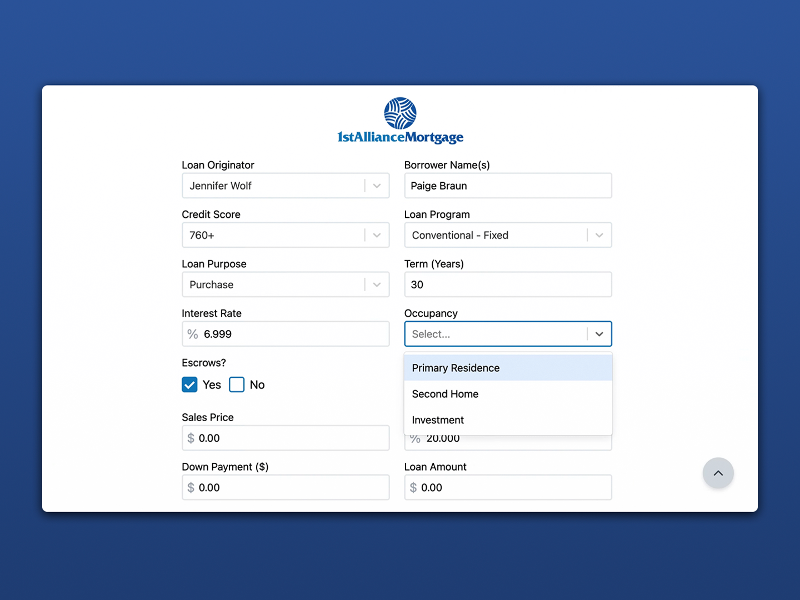
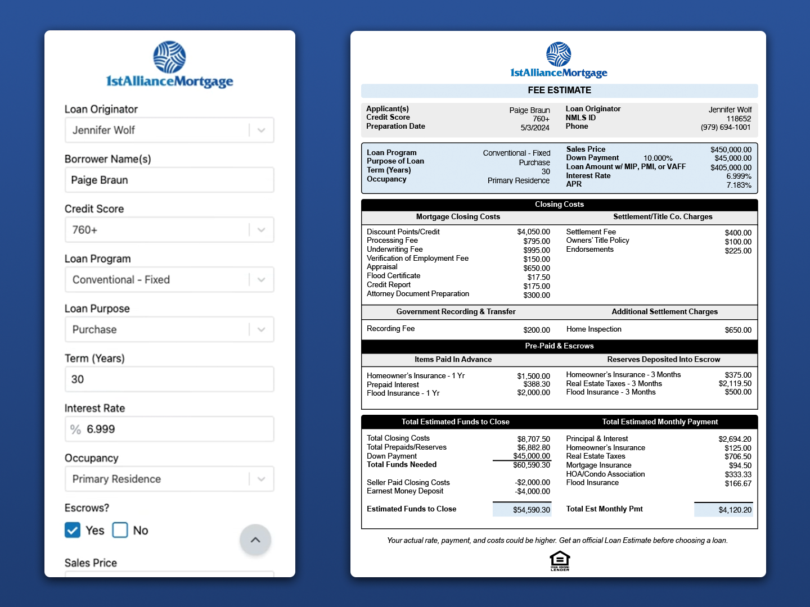

# Mortgage Fee Estimator

An application built for 1st Alliance Mortgage to allow loan officers to quickly and easily create and share fee estimates for potential borrowers. Loan officers at 1st Alliance Mortgage wanted something they could use on the go which is why I developed the site first with a mobile layout in mind. The app uses the information from the form to create a custom fee estimate pdf that can be downloaded or shared directly with clients.

:arrow_right: [Live Preview](https://paigebraun.github.io/1stam-fee-estimate/)

## Screenshots

## Features

-   Custom input fields that work like Excel
-   Responsive design for mobile use
-   Creates custom fee estimate sheet ready to share with borrowers

## Tech Stack

React, TypeScript, Tailwind, Vite, PDF-LIB, React-Hook-Form, React-Select, Framer Motion
